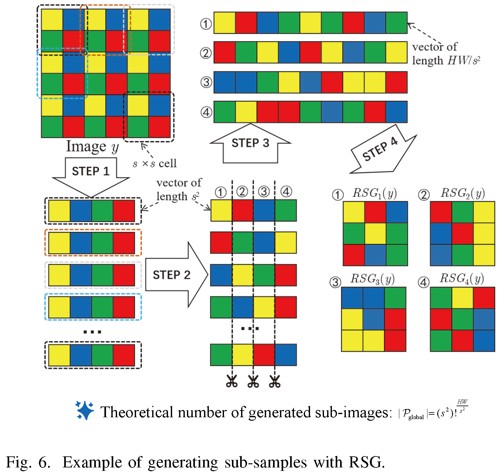
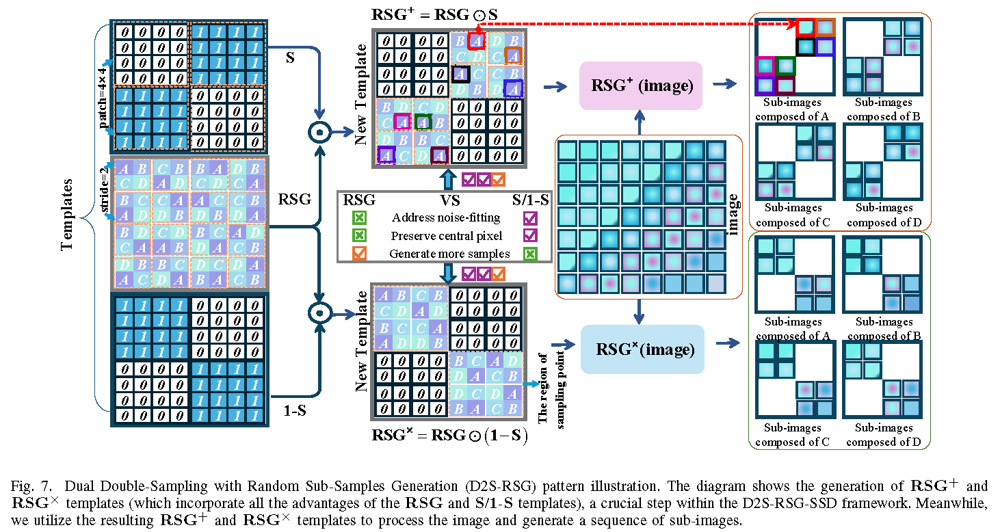
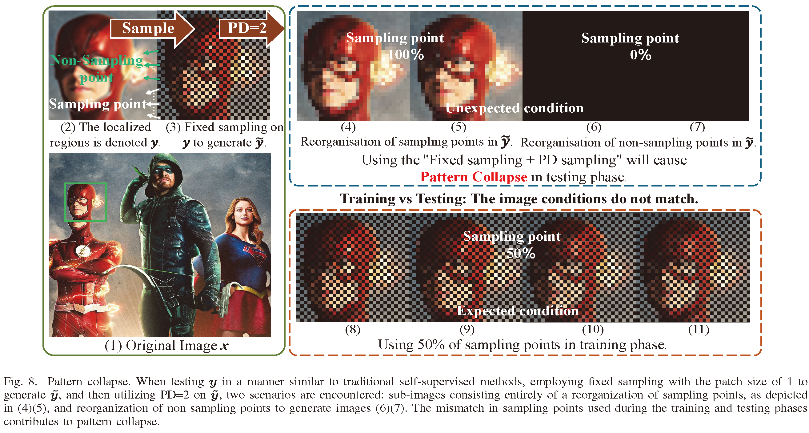
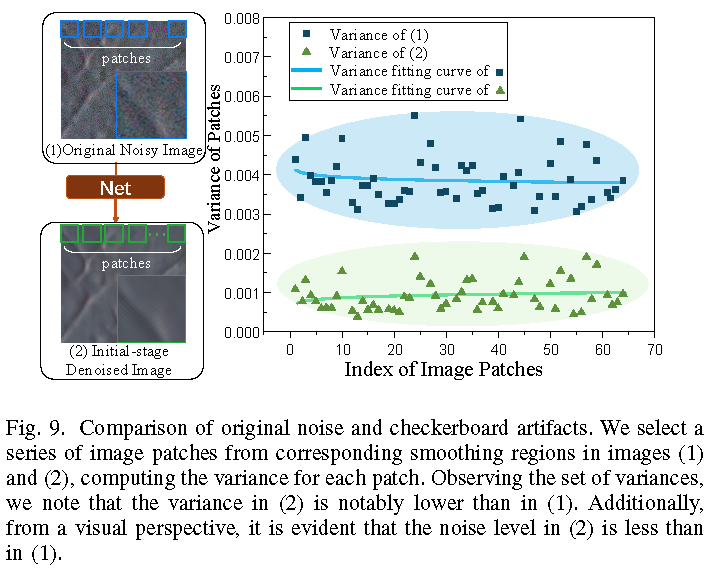
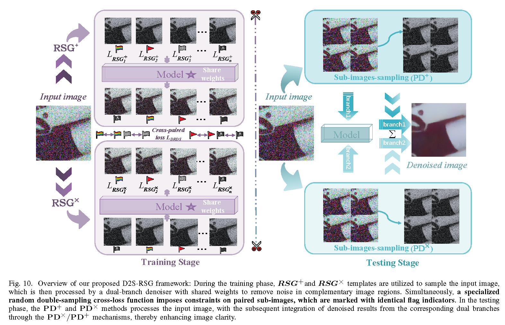
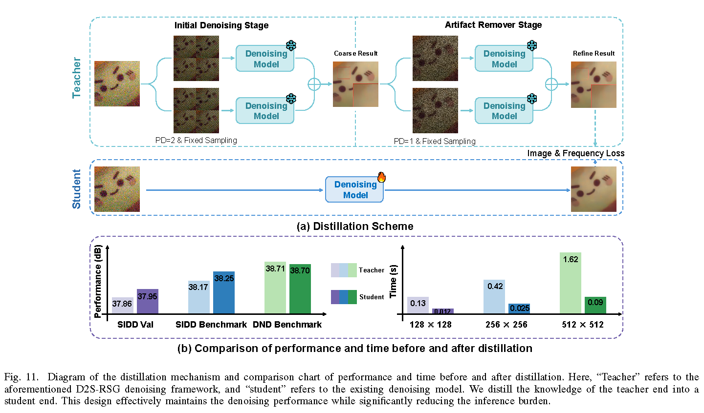
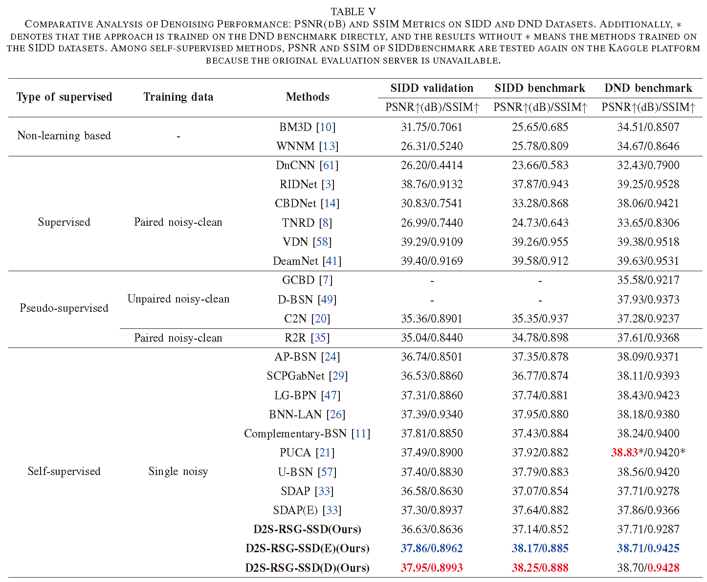
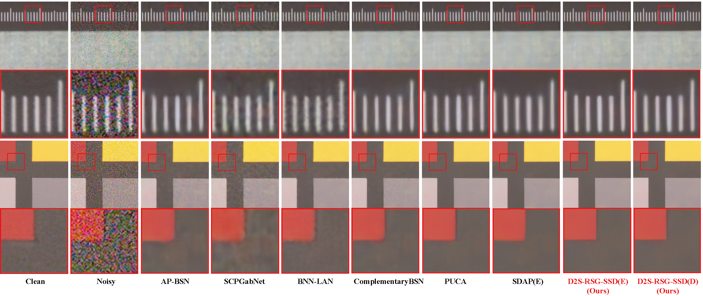
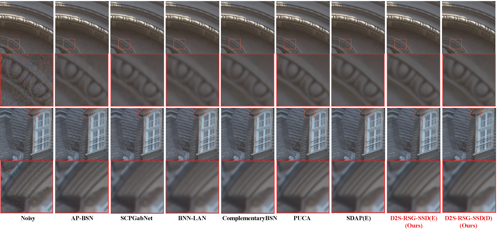
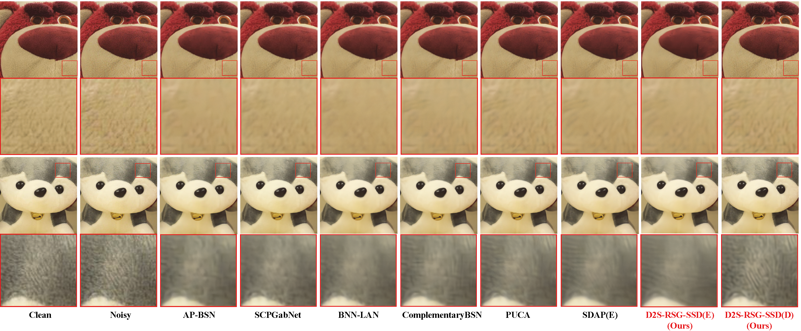

# **D2S-RSG-SSD: Dual Double-Sampling with Random Sub-Samples Generation for Self-Supervised Real Image Denoising**

## :writing_hand: Changelog and ToDos
- [ ] Code and the model pre-training weights.
- [x] Method introduction, model performance and results visualization  :fire::fire::fire:.

## :bulb: Abstract
Recent advancements in self-supervised denoising have underscored the potential of Blind-Spot Networks (BSNs). However, these methods face three main limitations:

- **Limitation-1:** Most self-supervised denoising methods perform sub-optimally in real-world scenarios due to their strict assumptions, \emph{e.g.,} noise is zero-mean and independently distributed.

- **Limitation-2:** The blind-spot operation leads to information loss, limiting denoising performance, while its removal causes noise overfitting, further degrading performance.

- **Limitation-3:** Self-supervised sampling-based denoising methods often introduce checkerboard artifacts, yet existing research fails to distinguish these artifacts from real noise.

To address these limitations, we propose a novel Dual Double-Sampling with Random Sub-samples Generation self-supervised denoising (D2S-RSG-SSD) framework that integrates RSG strategy for limitation-1, D2S strategy for limitation-2, and a dedicated artifact remover for limitation-3.

- **For Limitation-1:** Consider that existing methods either have strict assumptions limiting their application or perform sub-optimally due to insufficient training samples (e.g., sampling-based methods are usually trained by generating sub-samples and $s^{2}$ sub-samples generated by PD in APBSN). We treat the differences between sub-samples as perturbations. To introduce more diverse perturbations and increase the number of sub-samples, we propose the RSG strategy, which eliminates the fixed sampling pattern imposed by PD. Building on this, we develop a new RSG cross-paired loss $\mathcal{L}_{RSG}$ for BSN to fully utilize all sub-samples and stabilize optimization and design an improved BSN framework that incorporates RSG to enhance performance.

  

- **To address Limitation 2:** we propose a Dual Double-Sampling (D2S) strategy that adopts fixed sampling patterns and a dual-branch architecture. This design reduces reliance on pixel-level information and leverages complementary features to mitigate both noise overfitting and information loss. A key advantage is its compatibility with various advanced denoising networks, lifting the constraint of using BSNs in self-supervised settings. Additionally, we introduce a fixed sub-image sampling strategy to avoid pattern collapse during inference and ensure stability.

  
  
  Additionally, we find that applying traditional testing strategies often leads to pattern collapse, to ensure stable inference, we introduce a fixed sub-  image sampling strategy during testing.

  

- **For Limitation-3:** Consider that existing sampling-based methods usually introduce checkerboard artifacts and this problem is always ignored. To improve visual quality, one intuitive way is to apply BSN-based denoising again to suppress these artifacts. While this method reduces artifacts to some extent, it presents certain limitations. It does not differentiate the magnitudes between checkerboard artifacts and the original noise, treating both as equivalent. As a result, using the same denoiser for artifact suppression leads to over-smoothing, thereby compromising image details. We explicitly distinguish the checkerboard artifacts from noise characteristics and design a dedicated artifact remover to effectively mitigate checkerboard artifacts, preserving fine details while minimizing over-smoothing.

  

- **Finally**, we present a novel Dual Double-Sampling with Random Sub-samples Generation self-supervised denoising (D2S-RSG-SSD) framework which integrates RSG and D2S strategy with the $\mathcal{L}_{D2S-RSG}$ cross-paired loss function, enhancing the robustness of real image denoising. 

  

  In addition, to address the inference overhead introduced by the above two-stage denoising framework, we propose a knowledge distillation scheme to distill the knowledge of the two-stage teacher model into a single-stage student network. This design effectively maintains the denoising performance while significantly reducing the computational complexity. 

  

  

## :sparkles: Real Image Experiment

	
<strong>Quantitative Comparison with SOTA</strong> (click to expand) 

    

	Comparative Analysis of Denoising Performance: PSNR(dB) and SSIM Metrics on SIDD, DND and PolyU Datasets.

	
<strong>Qualitative Comparison with SOTA</strong> (click to expand) 

    

    

    

    

    

    

